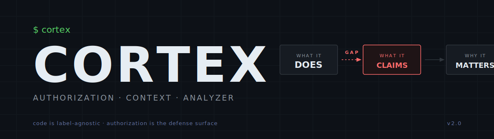

<p align="center">
  
</p>

# Cortex — Authorization Context Analyzer

> **Operations are neutral. Context is what makes it bad.**
>
> Code can't express intent or consent.
> Context is never in the code. It's external metadata.

Cortex helps you describe something — a piece of software, a scam email, any
behavior — in three parts: **what it does**, **what it took without asking**,
and **why that matters**.

You write the notes. Cortex formats them into a clean report, rates how serious
it is, and lets you compare examples side-by-side.

> Code is label-agnostic. The gap between what code *does* and what it *assumes
> the right to do* is the real defense surface.

See [`framework.md`](framework.md) for the full methodology, violation-class
taxonomy, and reference analyses.

---

## Quick start

```bash
python3 analyzer.py analyze examples/iloveyou.md
python3 analyzer.py analyze examples/xz_utils_backdoor.md --html
python3 analyzer.py validate examples/stuxnet.md
python3 analyzer.py compare examples/iloveyou.md examples/conficker.md
```

Outputs land in `output/reports/` by default:

- `<name>.json`           — structured data
- `<name>_report.md`      — human-readable markdown
- `<name>_report.html`    — optional HTML (dark theme)

---

## Using Cortex with a coding agent (Claude Code, Cursor, Aider, Copilot…)

The fastest way to produce a structured analysis of an unknown sample:

1. Clone this repo next to your sample:
   ```bash
   git clone https://github.com/Nicholas-Kloster/cortex-framework
   ```
2. Paste a prompt like this into your agent:

> Read `framework.md` and a few `examples/*.md` to learn the Cortex format.
> Then analyze `<path/to/sample>` and write
> `examples/<short-name>.md` with **SKELETON**, **VIOLATIONS**, **CONTEXT**,
> and an optional **REFERENCES** section. Then run
> `python3 analyzer.py analyze examples/<short-name>.md --html`
> and show me the output.

The agent reads the methodology + sample analyses, drafts a three-section
Cortex markdown file, and runs the analyzer. You get back:

- A reviewable analysis where every authorization claim is a falsifiable
  bullet, not an opaque "this looks malicious"
- Deterministic JSON / markdown / HTML reports from the analyzer
- Side-by-side comparability against the 14-sample reference corpus
  (`python3 analyzer.py compare examples/your-sample.md examples/stuxnet.md`)
- A citable artifact that holds up in a bug report, disclosure writeup, or
  incident review

The *structure* is enforced by the framework. The *drafting* leverages the
model. The authorization claims remain falsifiable by any human reviewer
who reads the resulting markdown.

See [`framework.md`](framework.md) § *Reasoning Transparency* for why this
beats a black-box LLM "looks malicious" verdict.

---

## Commands

### `analyze`

```
python3 analyzer.py analyze <file> [--json PATH] [--report PATH]
                                   [--html [PATH]] [--output-dir DIR] [--force]
```

- `--html` emits an HTML report alongside JSON + markdown. Path is optional.
- `--force` writes output even if validation fails (missing sections).

### `validate`

```
python3 analyzer.py validate <file>
```

Exit 0 if all three sections are present and non-empty. Surfaces parse warnings.

### `compare`

```
python3 analyzer.py compare <file1> <file2>
```

Terminal-width-aware side-by-side across all three sections, plus a summary
row covering severity, counts, and the skeleton → violation gap.

---

## Input format

```markdown
# Subject — Authorization Context Analysis

## SKELETON
- functional operation 1
- functional operation 2

## VIOLATIONS                  (or "## AUTHORIZATION VIOLATIONS")
- Assumes right to X without authorization
- Zero checks before Y

## CONTEXT THAT MAKES IT BAD   (or "## CONTEXT")
- Impact on owner/system
- Deception involved

## REFERENCES                  (optional, recommended for citable analyses)
- Primary source 1
- Primary source 2
```

Headers are case-insensitive and alias-tolerant.

---

## Severity

```
if violations ≤ 1:  severity = informational
else:
    score = violations + (context × 0.5)
    score ≥ 10 → critical
    score ≥ 6  → high
    score ≥ 3  → medium
    otherwise  → low
```

The `violations ≤ 1` cap exists because boundary-test samples (a tool repo
like Mimikatz or mgeeky/red-teaming) have dense CONTEXT sections that are
*framework commentary*, not *authorization harm*. Without the cap, those
samples inherit inflated severity from context weight they don't deserve.

The report also prints the **skeleton → violation gap** (`violations − operations`).
A positive gap is the tell for social-engineering / cognitive-layer attacks
(the attacker claims more rights than operations they visibly perform).
A deeply negative gap is the tell for LOTL, supply-chain, or boundary-test
samples (many operations, fewer explicit rights claims).

---

## The corpus

`examples/` contains 14 reference analyses across four delivery media:

| Category | Samples |
|---|---|
| Historical worms / APTs | ILOVEYOU, Conficker, Stuxnet, WannaCry, NotPetya, SUNBURST, Volt Typhoon, xz-utils, 3CX cascade |
| ICS / safety-system attacks | Triton / TRISIS |
| Social engineering | Phishing / 419 advance-fee scams |
| LLM-layer attacks | Prompt injection / jailbreak chains |
| Boundary tests (null-violation samples) | gentilkiwi/mimikatz, mgeeky/Penetration-Testing-Tools |

See `framework.md` § *Reference Analyses* for the full metrics table
(ops, violations, context, gap, severity) across all 14.

---

## Project layout

```
cortex-framework/
├── analyzer.py              # CLI + parser + renderers
├── framework.md             # Methodology, violation classes, corpus findings
├── examples/                # 14 reference analyses
├── output/reports/          # Generated JSON / MD / HTML artifacts
├── templates/               # HTML template stub
├── README.md
└── LICENSE
```

## Dependencies

Python 3.10+ standard library only. No `pip install` required.

---

## Attribution

Framework and corpus by **Nicholas Kloster** ([@Nicholas-Kloster](https://github.com/Nicholas-Kloster)).
Tooling and corpus extension developed as a Nuclide collaboration
(see `framework.md` § *Versioning*).

MIT licensed — see [`LICENSE`](LICENSE).
